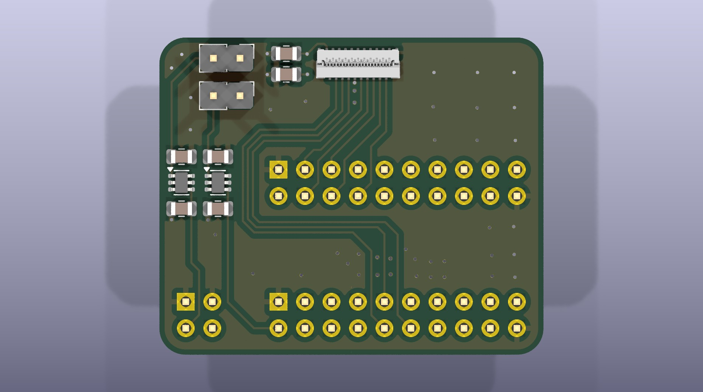
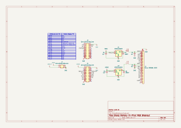

# Sharp Memory-in-Pixel Display Breakout for the nRF54L15-DK

    

Supports the following displays (with Molex 503566-2102 or 503566-2100 FPC connector):

- 30mm round, 240x240px [LS012B7DD06A](https://www.sharpsde.com/products/displays/model/ls012b7dd06a/#productview)
- 32mm round, 260x260px [LS013B7DD02](https://www.sharpsde.com/products/displays/model/ls012b7dd06a-1/#productview)
- 35mm round, 280x280px [LS014B7DD01](https://www.sharpsde.com/products/displays/model/ls012b7dd06a-1-1/)
- 55mm rectangular, 320x240px [LS021B7DD02](https://www.sharpsde.com/products/displays/model/ls012b7dd06a-1-1-1/#productview)

# Schematic

  

# Bill of Material

|Reference  |Qty|Value              |Footprint                                                 |
|-----------|---|-------------------|----------------------------------------------------------|
|C1,C2,C3,C5|4  |1uF                |Capacitor_SMD:C_0805_2012Metric                           |
|C4,C6      |2  |100nF              |Capacitor_SMD:C_0805_2012Metric                           |
|J1         |1  |Molex 503566-2102  |SharpBreakout-Connector_FFC-FPC:5035662102                |
|J2,J6      |2  |Conn_01x02_Pin     |Connector_PinHeader_2.54mm:PinHeader_1x02_P2.54mm_Vertical|
|J3,J5      |2  |Conn_02x10_Odd_Even|Connector_PinHeader_2.54mm:PinHeader_2x10_P2.54mm_Vertical|
|J4         |1  |Conn_02x02_Odd_Even|Connector_PinHeader_2.54mm:PinHeader_2x02_P2.54mm_Vertical|
|U1,U2      |2  |SiP32431DR3        |Package_TO_SOT_SMD:SOT-363_SC-70-6                        |

# Pinout

| nRF54L15-DK Pin | Sharp Display Pin |
|-----------------|------------------|
| P0.00 | R1 |
| P0.01 | BCK |
| P0.02 | B1 |
| P0.03 | G1 |
| P0.04 | VCOM/VB |
| P1.04 | VBUS_EN (VDD2_EN) |
| P1.05 | VDDIO_EN (VDD1_EN) |
| P1.06 | GCK |
| P1.07 | INTB |
| P1.08 | VA |
| P1.09 | GSP |
| P1.10 | GEN |
| P1.11 | BSP |
| P1.12 | R0 |
| P1.13 | G0 |
| P1.14 | B0 |
